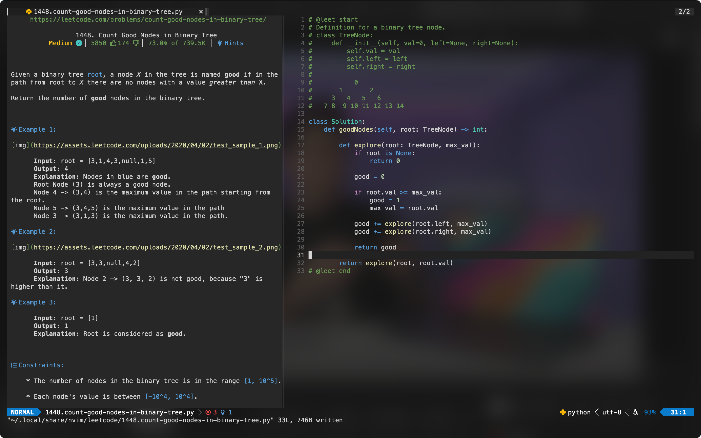
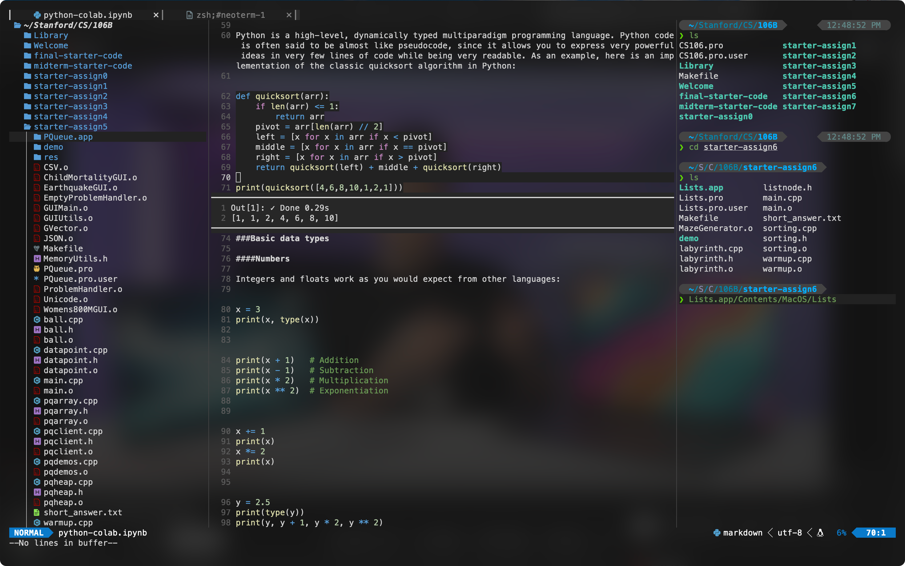

# dotfiles
setup

Latex Template from https://github.com/SeniorMars/latex_template

UltiSnips shortcuts from https://castel.dev/post/lecture-notes-1/

Lua config & organization from https://github.com/numToStr/dotfiles/tree/master/neovim/.config/nvim/lua

Jupyter Notebook setup from https://github.com/benlubas/molten-nvim/blob/main/docs/Notebook-Setup.md
