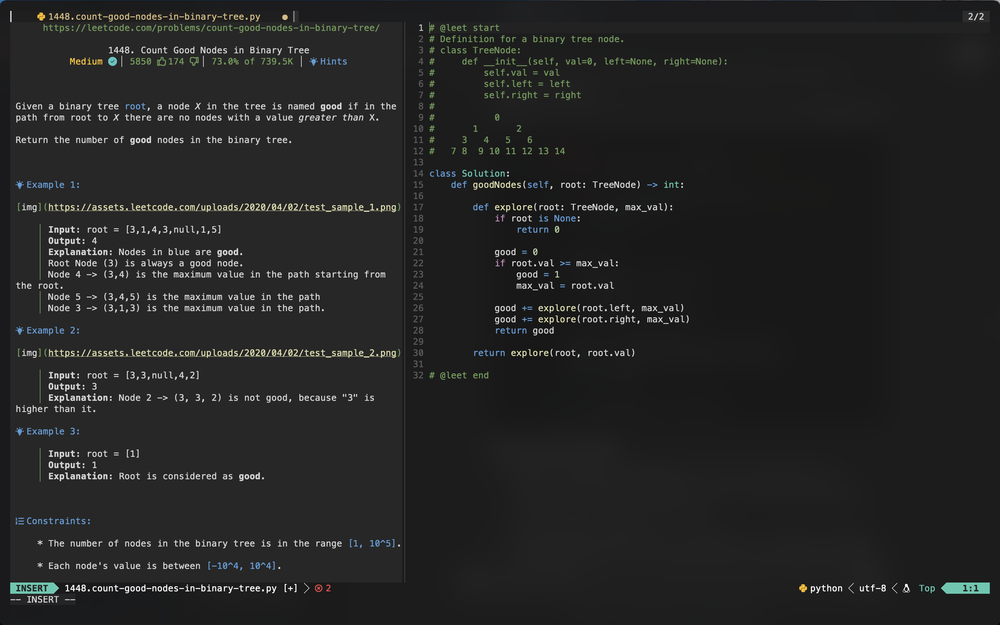
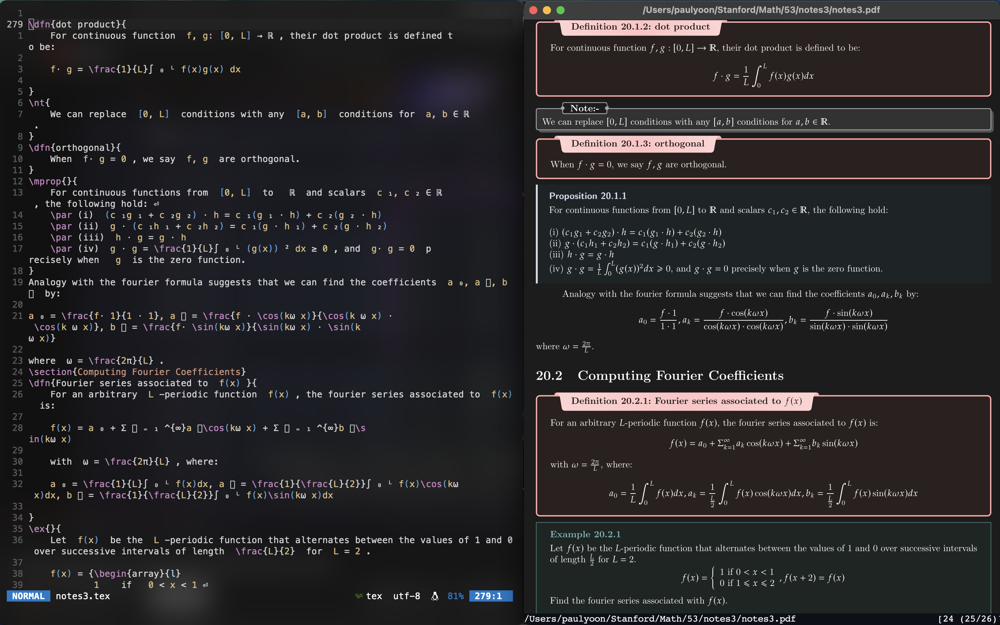
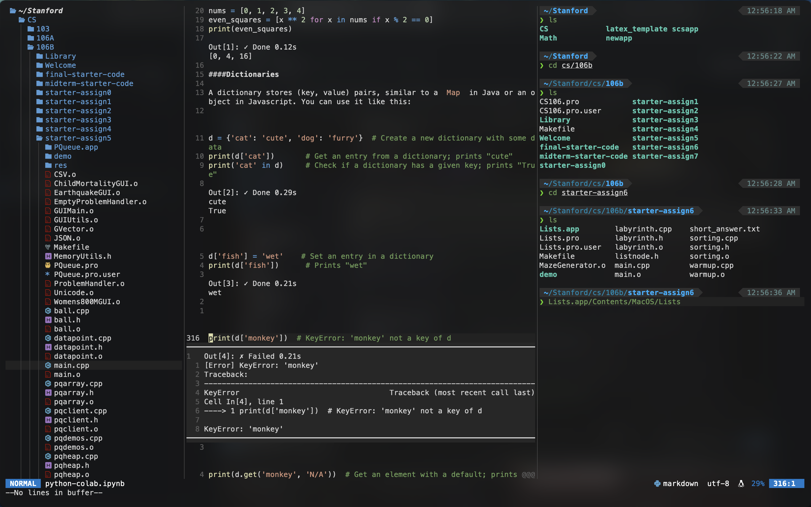

# dotfiles
stanford setup - neovim w/ IDE functionality (LSP, filetree, terminal, snippets for LaTeX, Jupyter Notebook support, Leetcode integration)

**Macbook Air M2 - 1TB SSD, 16GB RAM**
- Alacritty Terminal, transparent background
- Powerlevel10k zsh theme w/ MesloLGS Nerd Font

**Neovim:**
- VScode.nvim theme
- Lazy.nvim package manager
- VimTeX plugin for LaTeX support
- Zathura PDF Viewer

**Zathura:** Zathura is a headache. If you want to use it, I would follow part 6 here: https://ejmastnak.com/tutorials/vim-latex/intro/

Latex Template from https://github.com/SeniorMars/latex_template

UltiSnips shortcuts from https://castel.dev/post/lecture-notes-1/

Lua config & organization from https://github.com/numToStr/dotfiles/tree/master/neovim/.config/nvim/lua

Jupyter Notebook setup from https://github.com/benlubas/molten-nvim/blob/main/docs/Notebook-Setup.md
