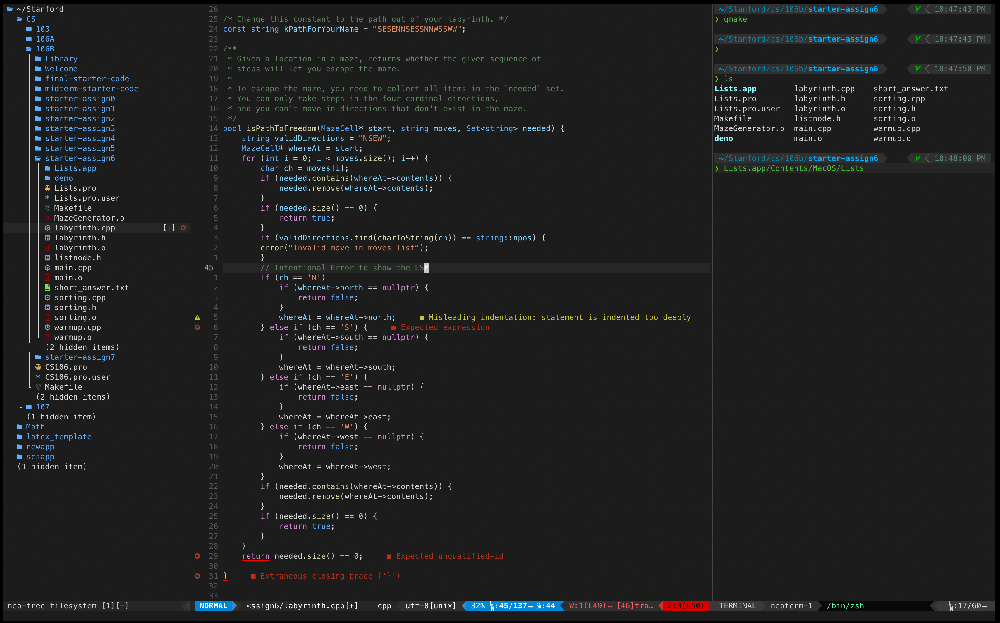
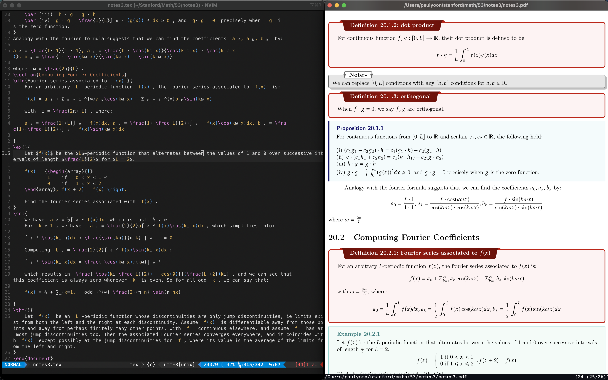
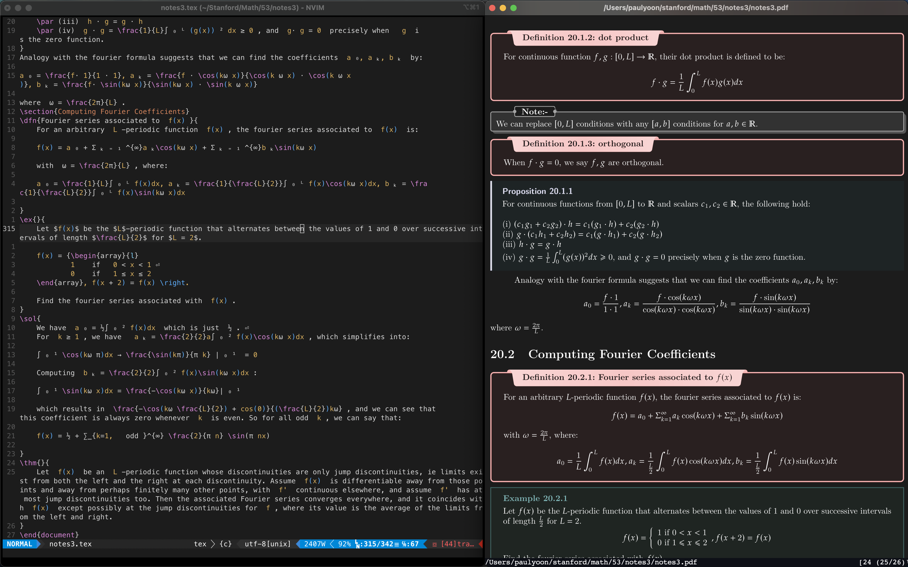

# dotfiles
stanford setup - neovim w/ IDE functionality (LSP, filetree, terminal, snippets for LaTeX, jupyter Notebook support)

Macbook Air M2 
- iTerm2/Alacritty
- Powerlevel10k zsh theme w/ MesloLGS Nerd Font
- VScode.nvim theme
- Neotree file tree
- Zathura PDF Viewer

Latex Template from https://github.com/SeniorMars/latex_template

UltiSnips shortcuts from https://castel.dev/post/lecture-notes-1/

Lua config & organization from https://github.com/numToStr/dotfiles/tree/master/neovim/.config/nvim/lua
