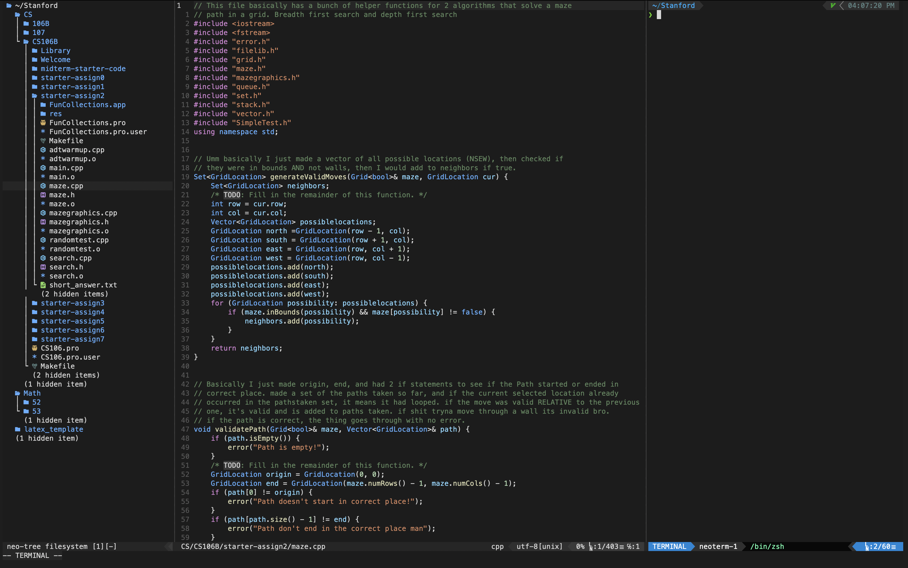
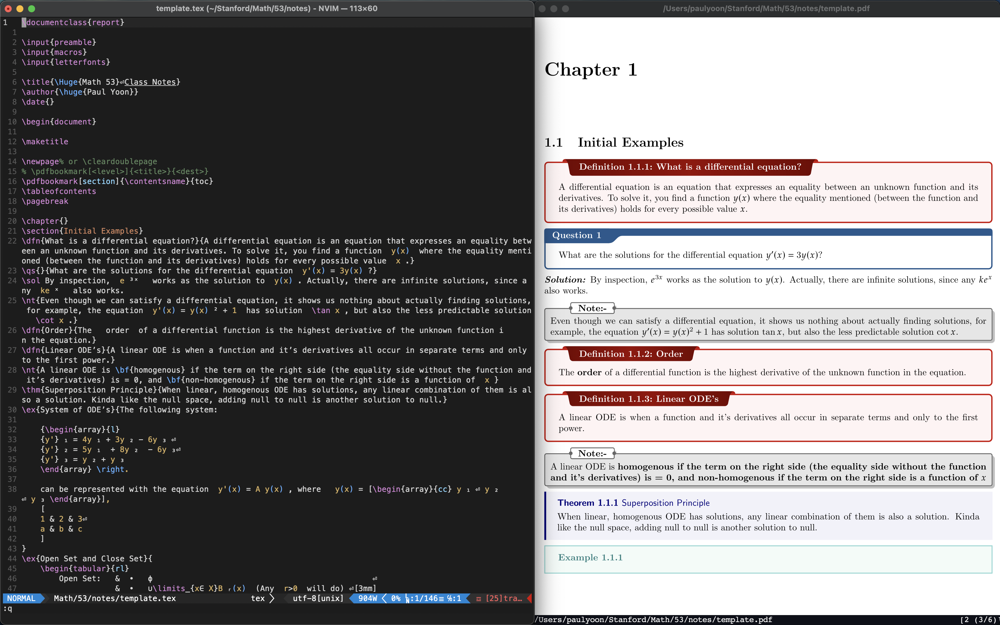
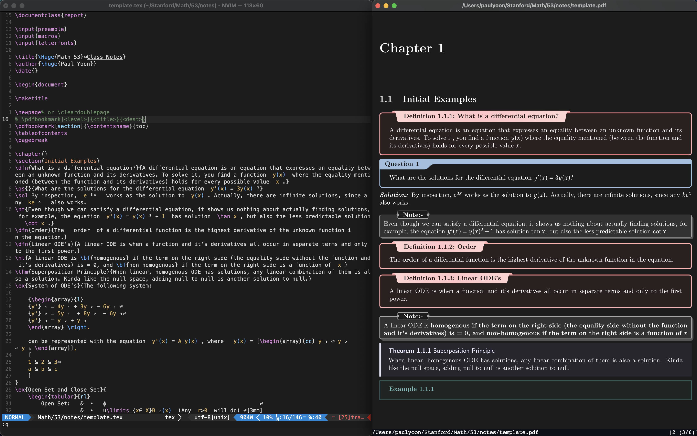

# dotfiles
stanford setup - neovim w/ IDE & LaTeX functionality

Macbook Air M2 
- Apple Default Terminal (battery life better than iTerm2)
- Powerlevel10k zsh theme w/ MesloLGS Nerd Font
- Nvim Code Dark theme
- Neotree file tree
- Zathura PDF Viewer

Latex Template from [github.com/](https://github.com/SeniorMars/latex_template)https://github.com/SeniorMars/latex_template
