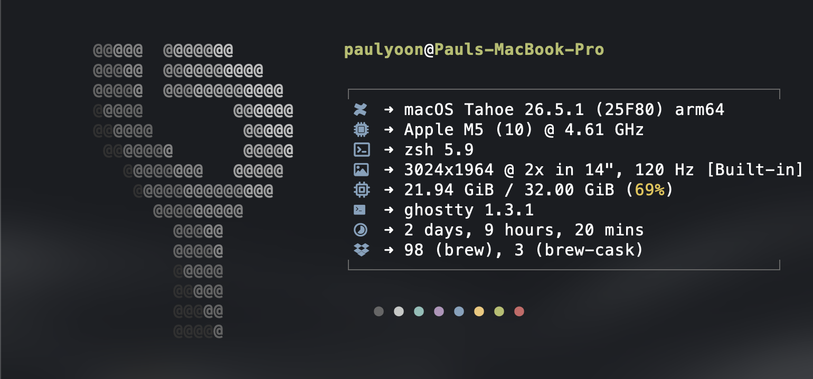

# dotfiles

personalized dotfiles for my laptop setup. 
- **/bin/**: collection of bash scripts. available everywhere.
- **/claude/**: my CLAUDE.md, custom statusline, and experimental system prompt [here](https://github.com/elder-plinius/CL4R1T4S/blob/main/ANTHROPIC/CLAUDE-FABLE-5.md)

- **/fastfetch/**: run `fastfetch` in terminal to get this:

- **/ghostty/**: config for the best terminal emulator
- **/nvim/**: custom nvim config forked from https://github.com/Nvchad/Nvchad.

(latex template from https://github.com/SeniorMars/latex_template)
- **/sioyek/**: customizations for the pdf viewer, shown above.
- **/tmux/**: customizations for multiple terminal split panes ()


## install

no idea why you'd want to install. ask Claude Code (https://code.claude.com/docs/en/quickstart) or really any other agent to install and configure this for you. Prompt:

```md
Clone the repository https://github.com/pauly00n/dotfiles into a directory `~/.dotfiles`. Then symlink all directories except for `/bin/` into `~/.config/`. Then, explain to me how to make changes and have them take effect from here
```

## uninstall

just ask Claude Code in that same session
